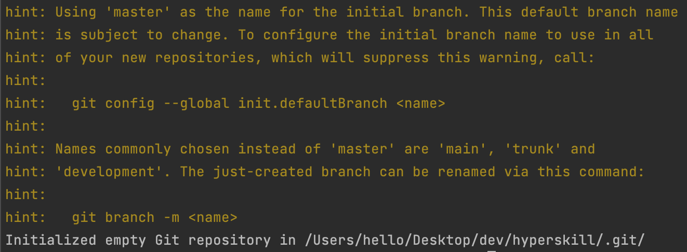
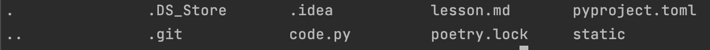
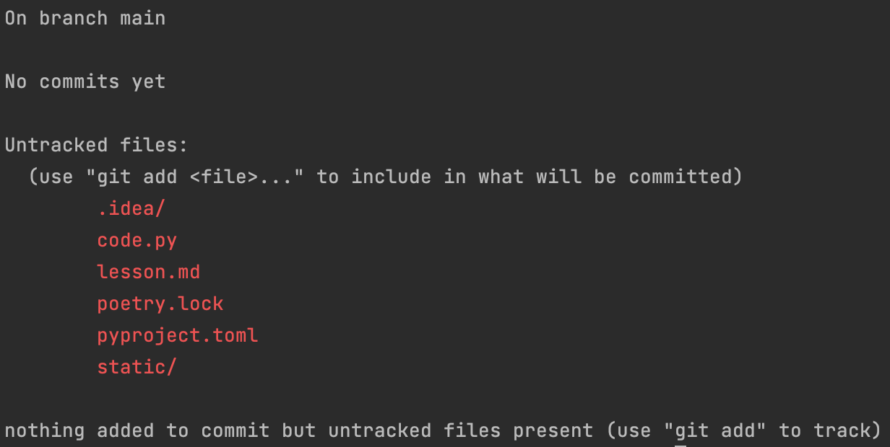
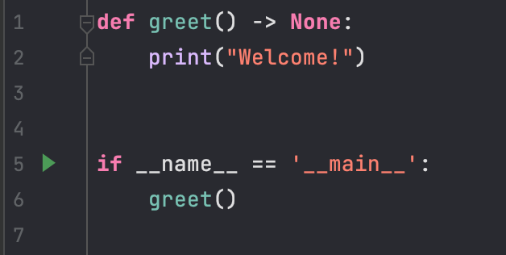
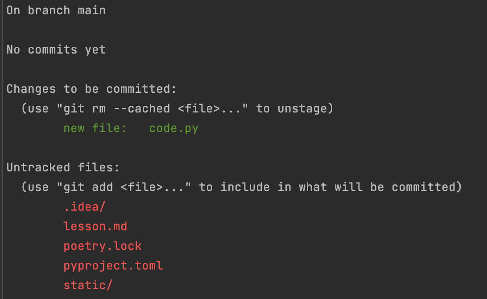
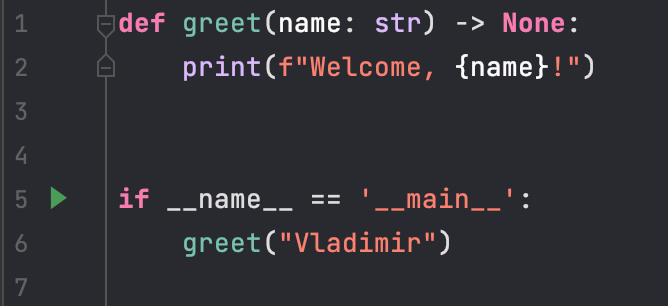
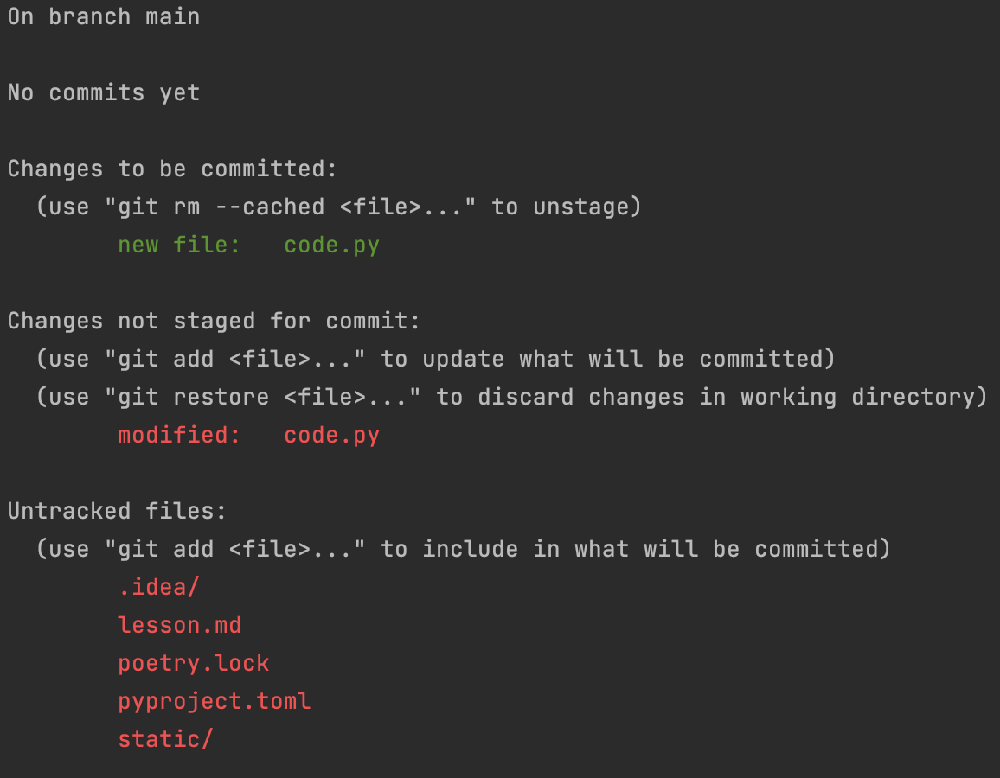
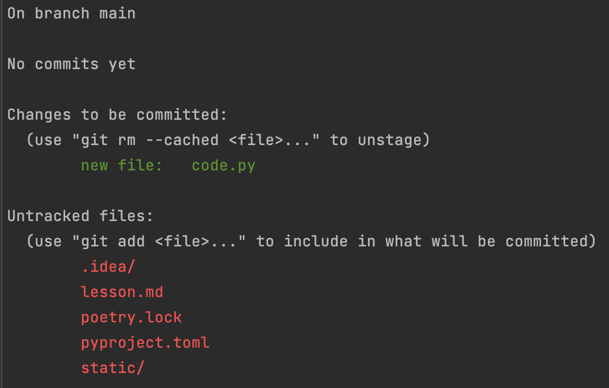
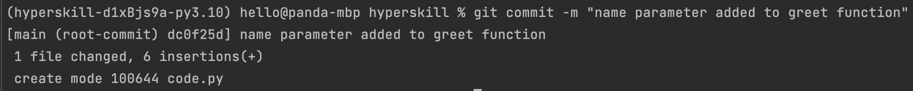
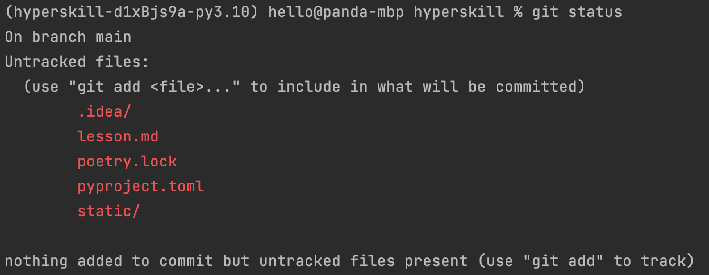

## Primer on Git - Basic Introduction

<!-- TOC -->

* [Prerequisites](#prerequisites)
* [Why - The Need for Tracking](#why---the-need-for-tracking)
* [What - Version Control System](#what---version-control-system)
    * [Version Control System - Git](#version-control-system---git)
* [How - Working with Git](#how---working-with-git)
* [Conclusion](#conclusion)

<!-- TOC -->

### Prerequisites

Git installed locally. For installation, refer to the [official documentation](https://git-scm.com/downloads) for your
system.

### Why - The Need for Tracking

As developers, most of us have had to work or work on projects spanning more than just a couple of days,
weeks or even months. This development phase primarily consists of writing code, lots of lines of code. And it is not
just writing the code and getting done with it. As programmers, we go back to the code to optimise and clean it. And
this process is repeated multiple times and continues till the very end when we finally wrap up and package our code,
ready to be deployed. In short, software (and code) is written in iterations over a certain duration.

Because writing code is not a *one shot* process that is completed in one sitting, we need a way to keep a
track of all the changes that happen to the code and by changes, it is meant that we essentially have a system that
helps us establish a **timeline** of our project which, in turn, allows us to *go back in time* and *checkout* an
older *version* of the code. In other terms, we need what we call a *Version Control System*, VCS in short.

Another strong reason that necessitates the use of a VCS is collaboration. Software development involves big projects
involving developers from around the world. In such cases, it becomes even more important to have a system where each
developer can work locally as per his requirements and finally send or *push* his changes or updated code to the central
server, ready to be tested and merged with the original codebase.

A VCS allows us to achieve both the above objectives and therefore is a tool of significant importance in a developer's
arsenal and thus is our focus of this lesson.

### What - Version Control System

#### Version Control System - Git

As explained in the previous section, a VCS helps us to maintain different versions of our code thereby providing us
with a way to keep a record of all the changes that were done over a period of time. There are different kinds of VCS,
however for now, we would keep our focus on probably the most popular VCS system - **Git**. It is free and open-source.

Git is a type of distributed version control system where every developer involved in a project has a copy of the
complete code on his machine. This is in stark contrast to other kinds of VCS such as the centralised VCS. The
differences between then can be read [here](https://www.wikiwand.com/en/Distributed_version_control). To get to know
more about this amazing tool, let’s get our hands dirty with directly working with it.

In this article, there are four main basic commands that we are going to work with that are at the core of Git. It is
expected that Git is installed on your local machine.

* Git init
* Git status
* Git add
* Git commit

To start, please ensure Git is installed and an empty directory exists. We will take it further from here. Let's take a
look at each of these commands one-by-one.

### How - Working with Git

* #### Git init

This command is used within a directory and allows Git to set its eyes on it. The command is typed at the terminal
inside the directory - `git init`. When working locally with Git, this command helps us set up and initialise a repo (
short for repository). This specific directory is now under the *supervision* of Git.

In order to confirm this, type `ls -a` (if on macOS/Linux) at the terminal. This command *lists* all the files,
including the *hidden ones*. You should see a directory *.git*, which contains the git files. At this point, we have a
directory without any code files with Git as our *sentry*. On executing the above command, we get the following message:

In other words, using this command is like telling Git - *Hey, this is the directory that I would like you to monitor
and track*.

Good! With this, we now have set up Git inside a directory, which is known as the *working directory*. In the example
above, *Hyperskill* is our working directory.

* #### Git status

An important and quite frequently used command is the `git status`. As the name says, it tells us the status, but
status of what? As we will see later, a file within a git directory can have a different *status* depending on whether
it is in the *working directory,* *staging area* or *local repo,* or it is *untracked*. We will discuss these
different *stages* shortly. The key point is that it tells us the status of all the files present within the working
directory. When in doubt about the status of a file, feel free to use this and Git will tell you the current status of
that file.

For example, on typing the above command in my working directory, Git tells me the following:

It tells me which files are present in the directory but are not being tracked yet. This means that Git knows about the
already existing files within the working directory but does not track them unless we explicitly tell it to. This is
precisely what the next command does.

* #### Git add

With the initial setup with Git, let's go ahead and create a Python file and see how to make Git track it. Now we will
see the real power of *git*, the VCS. For this, a Python file (*code.py*) was created. It calls a function `greet` which
prints out the string *Welcome* on to the console.

As we would like Git to track it, we type out in the console `git add code.py`. This tells Git to track this particular
file specifically. By tracking it, Git will allow us to keep a record of all the changes that we will implement in our
file and help us *checkout* any version as and when required. This action of *adding* the file moves the file
to a special area designated as the *staging area*. It can be said that the file has been staged for changes or *
staging* a file.

Running `git add code.py` should not give any output and usually that means all good i.e. the command ran successfully.
To confirm if the file was set up for tracking, check the status using `git status`. As shown below, the file *code.py*
is displayed under *changes to be committed* (*staging area*) and is in green color - Git is tracking the file now!

Let us see if Git is really tracks the changes or not. I change the *greet* function by personalizing the welcome
message for a particular person.

Now if the status is checked, Git says:

Great! Git detected the changes we did to the code and took note of it. As shown in the status, we now have a *modified*
tag for the file *code.py*. Git also tells us that if we would not like to keep the changes and go back to the previous
version, we can use `git restore code.py` to *restore* the file.

What is interesting to observe at this point is that Git presents the modified file as a **new file** which has not yet
been added to the staging area and is still in the working directory. Therefore, if we decide to go ahead with the
changes, we have to *add* this *modified* version too of the existing file to the staging area, which would then replace
it there, as it is the same file (has the same name). This is what we do next, and we get the following after checking
the status again. This also gives a little insight into how Git actually works. It stores *snapshots* of a file as it
tracks it and uses these *snapshots* to compare the differences between different versions of a file.
So `git add code.py` and `git status` gives:

The file *code.py* is now edited and the edited version has been added to the staging area. With our changes done, let
us go ahead with this version of our file and *commit* it to the repo, in other terms - *save the changes*

* #### Git commit

Once we have finalized our changes, we need to save them just as we normally do when we save our files before wrapping
up our work for the day. This action of *saving* in Git lingo is termed as *committing* the changes, and it tells Git to
take the file(s) in the staging area and *record* or *save* them as they are (as *snapshots*) i.e. *commit* them to the
repo.

This is achieved using the `git commit -m "commit message"` command. The commit message (in double quotes) is a short
description of the changes that were done to the file compared to its last state or version. A good commit message is
concise and helps the developer and other developers to gain a quick understanding as to what was done in this commit. A
commit can consist of several changes.

On issuing this command, all the changes are committed:

`git status` confirms that no more changes are pending to be committed and the staging area is clear once more as files
existing there previously have been committed to the local repo.

This is the standard set of operations/actions that are used on a daily basis by the developers as they work locally on
their machines and use Git to keep track of their work. The next step usually involves *pushing* or *sending* these
locally committed changes to a remote repo. In this way, the developers collaborating on a project can push their
individual changes to the codebase (existing on a central server like GitHub).

### Conclusion

In this first lesson, we got off to a basic start with an introduction to a VCS, specifically Git, and saw how powerful
it is in managing our code. Through four basic Git commands, we got an insight into how Git tracks files and how they
can be committed to the local repo, ready to be pushed to a remote repo.

In the next lesson, we dive deeper with Git and look at the various ways to reverting changes, and rolling back to the
previous versions.

